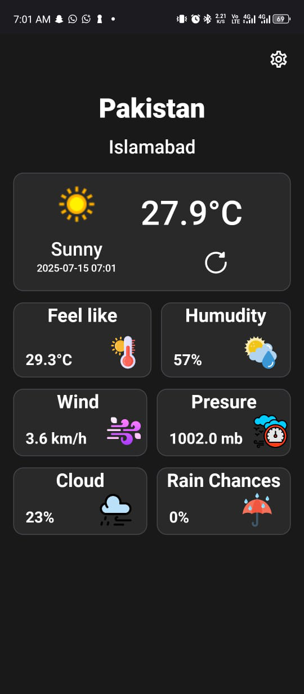
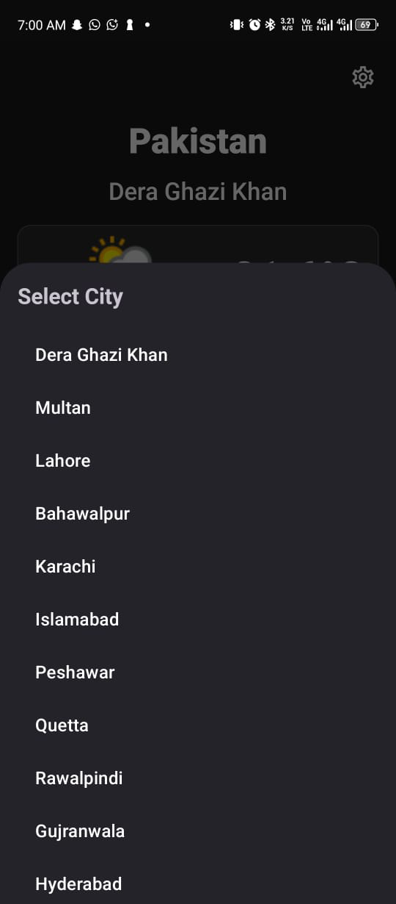

# Weather App – Android (Java/Kotlin)

A simple and modern Android app to check real-time weather. Built using Java/Kotlin and WeatherAPI, with location-based updates, custom city selection, and a clean UI.

## 📷 Screenshots

### Home Screen  

### City Selection  

## 🔹 Features
- 🌤 Real-time weather updates (temperature, humidity, wind, etc.)
- 📍 Location-based weather
- 🌆 City selection from custom list
- 🎨 Clean UI using BottomNavigationView and Fragments
- 🌐 API integration with Volley or Retrofit
- 💾 Data storage using SharedPreferences

## 🧰 Tech Stack
- Android Studio
- Java/Kotlin
- WeatherAPI.com
- Volley or Retrofit
- SharedPreferences
- Git & GitHub
